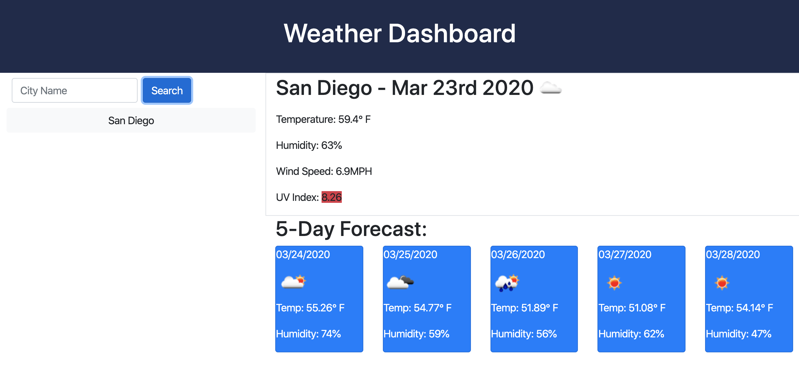
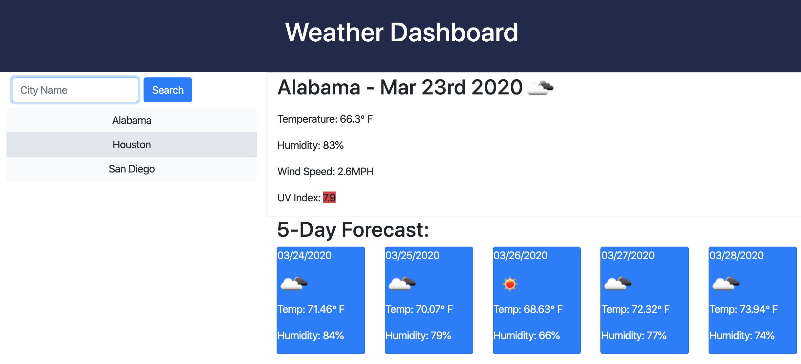

# Weather Dashboard

This application provides weather data for a chosen city on the current day and also provides a 5 day forecast. The UV Index is color coded to highlight severity. 

## Usage

To search for weather data, enter a city name in the search box.  
Search history is saved beneath the search box.  
To get weather data from a previously searched city, simply click the city button.  
When the page is refreshed the last search weather data and the search history buttons will load.  

## Links

Github Repo: https://github.com/jkaplanis/weather-dashboard
Deployed Application: https://jkaplanis.github.io/weather-dashboard/

## Screenshots

